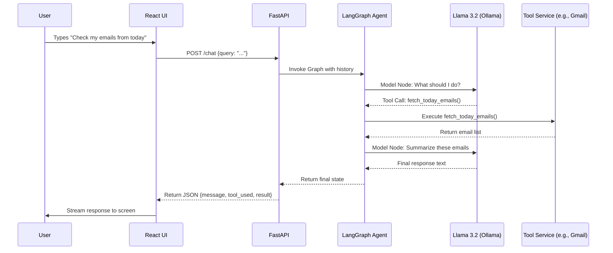

# Poly-Agent: Multi-Platform AI Assistant

This document explains the end-to-end architecture and request flow of the Poly-Agent project.

## 🏗️ Architecture Overview

The project is built as a decoupled **Client-Server** application:

1.  **Frontend**: A modern React application (Vite + Tailwind CSS) providing a rich, conversational interface.
2.  **Backend**: A Python-based FastAPI server powered by **LangGraph** for sophisticated agentic reasoning and tool orchestration.
3.  **Intelligence**: Uses **Ollama (Llama 3.2)** for local LLM processing and **Pinecone** for long-term vector memory.

---

## 🧠 Core Concepts Explained

### 1. LangChain
**LangChain** is the foundational framework used to build this application. It provides a standard interface for interacting with various LLMs (like Llama 3 via Ollama) and simplifies the process of chaining different components together (prompts, models, and output parsers). It allows us to easily swap models and integrate with external tools.

### 2. LangGraph
**LangGraph** is an extension of LangChain designed for building stateful, multi-actor applications with LLMs. Unlike simple linear chains, LangGraph allows us to create **cyclic graphs**, which are essential for building "Agentic" workflows.
-   **Nodes**: Represent functions or steps (e.g., `Model Node`, `Tools Node`).
-   **Edges**: Define the flow between nodes.
-   **State**: Maintains a persistent memory of the conversation and tool outputs throughout the execution loop.

### 3. RAG (Retrieval-Augmented Generation)
**RAG** is the technique used to give the agent access to data it wasn't originally trained on. In this project:
-   **Retrieval**: When a query requires specific knowledge (like past user preferences), the system searches the **Pinecone** vector database.
-   **Augmentation**: The retrieved information is added to the prompt context.
-   **Generation**: The LLM generates a response based on both its internal knowledge and the provided external context, ensuring high accuracy and personalization.

---

## 🛠️ Core Components

### 1. The Agent (Backend Logic)
Located in `backend/main.py`, the agent is defined using a **StateGraph**:
-   **Model Node**: Invokes the LLM to decide the next action.
-   **Tools Node**: Executes external service calls (Telegram, WhatsApp, etc.).
-   **Conditional Edges**: Determines if the agent should continue calling tools or finalize the response.

### 2. Multi-Platform Integrations
-   **Telegram**: Uses `Telethon` to read/send messages via user/bot sessions.
-   **WhatsApp**: Integrates with **Twilio API** for outbound messaging.
-   **Gmail**: Uses standard SMTP (sending) and IMAP (fetching) with app passwords.
-   **Web Search**: Uses **Tavily AI** to fetch real-time information from the internet.
-   **Memory**: Uses **Pinecone** vector store to save and retrieve long-term context.

---

## 🔄 The Request Flow

### Detailed Step-by-Step:
1.  **Input**: The user enters a prompt in the React interface.
2.  **Processing**: The frontend sends the query to the `/chat` endpoint.
3.  **Reasoning**: The Backend initializes a LangGraph session. The LLM (Llama 3.2) analyzes the prompt and selects the appropriate tool from the predefined toolset.
4.  **Execution**: If a tool is selected (e.g., `send_whatsapp_message`), the backend executes the Python function associated with that tool.
5.  **Refinement**: The output of the tool is sent back to the LLM, which formats it into a human-friendly response.
6.  **Response**: The backend returns the final text and any metadata (like which tool was used) to the frontend.
7.  **Display**: The frontend uses a custom streaming hook to "type out" the response word-by-word for a premium UX.

---

## 💾 Data Persistence
-   **Session History**: The backend maintains a short-term memory of the current conversation in an in-memory dictionary.
-   **Vector Memory**: Important facts are embedded using `mxbai-embed-large` and stored in **Pinecone** for cross-session recall.

---

## 🚀 Key Technologies
-   **Backend**: Python, FastAPI, LangChain, LangGraph, Ollama, Twilio, Telethon.
-   **Frontend**: React, Tailwind CSS, Lucide Icons, React Markdown.
-   **Design**: Custom-built CSS variables supporting seamless Light/Dark mode transitions.