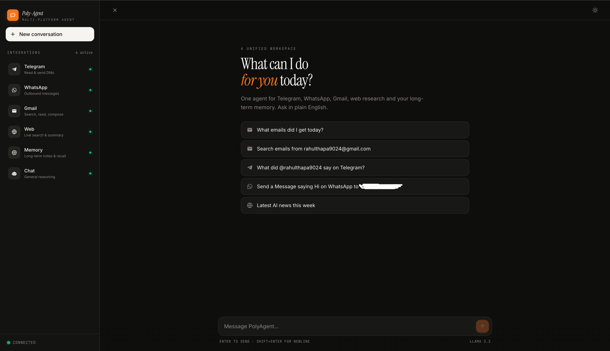
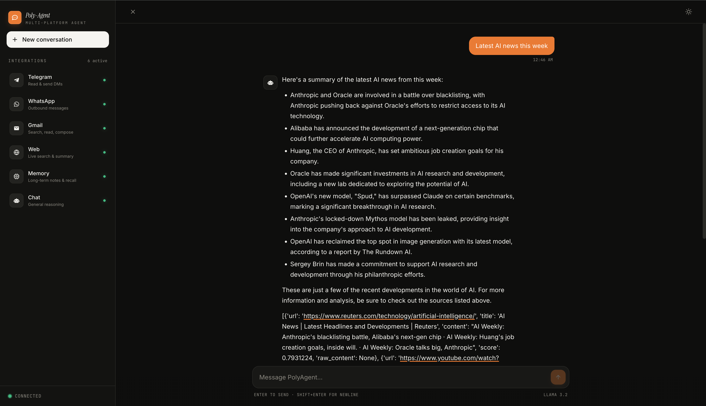
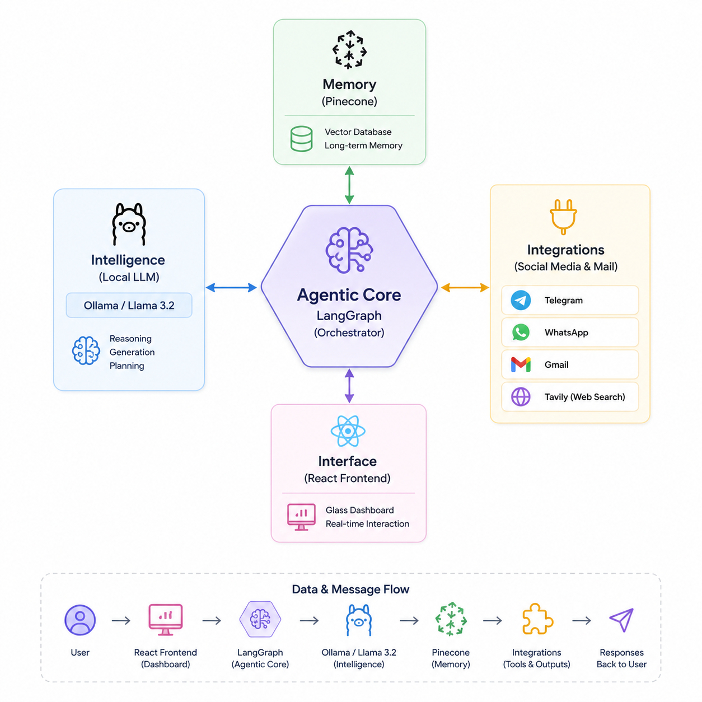

# 🤖 Poly-Agent: Multi-Platform AI Assistant

Poly-Agent is a powerful, agentic AI assistant designed to unify your communication platforms. Built with **LangGraph** and **FastAPI**, it can read and send messages across **Telegram**, **WhatsApp**, and **Gmail**, search the web in real-time using **Tavily**, and maintain long-term memory via **Pinecone**.
# Preview Images



---
# Flow Diagram


---

## ✨ Features

-   **Telegram Integration**: Read recent messages and send new ones to users/groups.
-   **WhatsApp Integration**: Send automated messages via Twilio.
-   **Email Management**: Fetch, search, and send emails using Gmail (IMAP/SMTP).
-   **Web Intelligence**: Real-time web searching using Tavily AI.
-   **Long-term Memory**: RAG-based memory system using Pinecone vector database.
-   **Local Intelligence**: Runs entirely on local LLMs (Llama 3.2) via Ollama for privacy and speed.
-   **Modern UI**: Sleek React-based dashboard with glassmorphism and smooth animations.

---

## 🏗️ Tech Stack

-   **Frontend**: React (Vite), Tailwind CSS, Lucide Icons.
-   **Backend**: Python 3.10+, FastAPI, LangChain, LangGraph.
-   **AI/LLM**: Ollama (Llama 3.2), mxbai-embed-large.
-   **Database**: Pinecone (Vector Store).
-   **Services**: Twilio (WhatsApp), Telethon (Telegram), Gmail API.

---

## 🚀 Local Setup Guide

### 1. Prerequisites
-   [Python 3.10+](https://www.python.org/downloads/)
-   [Node.js & npm](https://nodejs.org/)
-   [Ollama](https://ollama.com/) (Installed and running)

### 2. Clone the Repository
```bash
git clone https://github.com/rahulthapa9024/multi-platform-agent.git
cd multi-platform-agent
```

### 3. Backend Setup
```bash
cd backend

# Create virtual environment
python -m venv venv
source venv/bin/activate  # On Windows: venv\Scripts\activate

# Install dependencies
pip install fastapi uvicorn langchain langchain-ollama langgraph pinecone-client telethon twilio python-dotenv tavily-python langchain-pinecone
```

### 4. Frontend Setup
```bash
cd ../frontend
npm install
```

### 5. Ollama Setup
Ensure Ollama is running and pull the required models:
```bash
ollama pull llama3.2
ollama pull mxbai-embed-large
```

---

## 🔑 API Keys & Environment Configuration

Create a `.env` file in the `backend/` directory and populate it with the following:

```env
# Gmail Configuration
EMAIL=your-email@gmail.com
GMAIL_PASSWORD=your-app-password

# Twilio (WhatsApp)
TWILIO_ACCOUNT_SID=your_sid
TWILIO_AUTH_TOKEN=your_token

# Telegram
TELEGRAM_API_ID=your_api_id
TELEGRAM_API_HASH=your_api_hash

# Search & Memory
TAVILY_API_KEY=your_tavily_key
PINECONE_API_KEY=your_pinecone_key
PINECONE_INDEX_NAME=aiassistant
PINECONE_ENVIRONMENT=us-east-1
```

### 📘 How to get the keys:

#### 📧 Gmail (App Password)
1.  Go to your [Google Account Settings](https://myaccount.google.com/).
2.  Enable **2-Step Verification**.
3.  Search for **App Passwords**.
4.  Generate a new app password for "Mail" and "Other (Custom Name)".
5.  Copy the 16-character code into `GMAIL_PASSWORD`.

#### 📱 Telegram (API ID & Hash)
1.  Log in to [my.telegram.org](https://my.telegram.org).
2.  Go to **API development tools**.
3.  Create a new application (fill in random details).
4.  Copy the `App api_id` and `App api_hash`.

#### 💬 WhatsApp (Twilio)
1.  Sign up for a [Twilio Account](https://www.twilio.com/).
2.  Go to the **Console Dashboard** to find your `Account SID` and `Auth Token`.
3.  Set up the **WhatsApp Sandbox** in the Messaging section to get a "From" number.

#### 🔍 Web Search (Tavily)
1.  Visit [Tavily AI](https://tavily.com/).
2.  Create a free account and copy your API Key from the dashboard.

#### 🧠 Memory (Pinecone)
1.  Create a free account at [Pinecone](https://www.pinecone.io/).
2.  Create a new Index named `aiassistant` with **1024 dimensions** (for mxbai-embed-large).
3.  Copy your API Key and Environment name.

---

## 🏃‍♂️ Running the Application

### Start the Backend
```bash
cd backend
uvicorn main:app --reload --port 8000
```

### Start the Frontend
```bash
cd frontend
npm run dev
```

The application will be available at `http://localhost:5173`.

---

## 🤝 Contributing
Contributions are welcome! Please feel free to submit a Pull Request.
